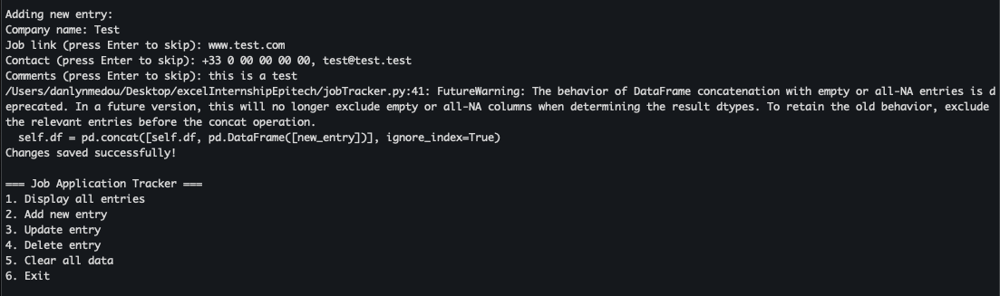
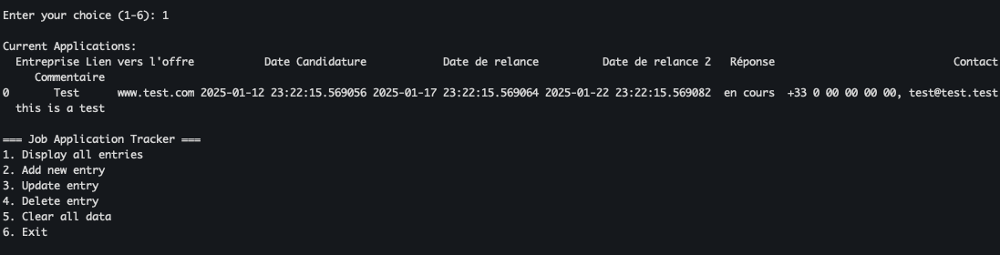
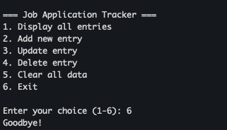
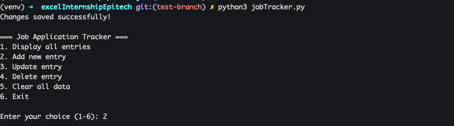

# Job Application Tracker

A Python-based command-line tool to help track and manage job applications. This tool allows users to maintain a record of job applications, including company details, application dates, follow-up dates, and status updates.

---

## Features

- Display all job applications
- Add new job applications
- Update existing entries
- Delete entries
- Clear all data
- Automatic follow-up date calculations
- Excel-based storage

---

## Prerequisites

- Python 3.x
- pip (Python package installer)

---

## Installation

1. Clone the repository:
   ```bash
   git clone https://github.com/yourusername/excelInternshipEpitech.git
   cd excelInternshipEpitech
   ```

1.  Create and activate a virtual environment:

    ```bash
    # On Windows
    python -m venv venv
    venv\Scripts\activate

    # On Mac/Linux
    python3 -m venv venv
    source venv/bin/activate
    ```

2.  Install required packages:
    ```bash
    pip install -r requirements.txt
    ```

* * * * *

Usage
-----

1.  Run the program:
    ```bash
    python jobTracker.py
    ```

2.  Choose from the following options:
    -   1: Display all entries
    -   2: Add new entry
    -   3: Update entry
    -   4: Delete entry
    -   5: Clear all data
    -   6: Exit

* * * * *

### Example Usage

#### Adding a New Entry

When you select option 2, you can add a new job application. Enter the required details, and the program will save the entry to the Excel file.



#### Displaying All Entries

When you select option 1, the program will display all the job applications stored in the Excel file.



#### Exiting the Program

When you select option 6, the program will exit gracefully.



#### Running the Program

Here's an example of running the program and adding a new entry:



* * * * *

Data Storage
------------

Data is stored in an Excel file named `Digi2 - [Prénom] [NOM] copy.xlsx` with the following columns:

-   Entreprise (Company)
-   Lien vers l'offre (Job Link)
-   Date Candidature (Application Date)
-   Date de relance (Follow-up Date)
-   Date de relance 2 (Second Follow-up Date)
-   Réponse (Response)
-   Contact
-   Commentaire (Comments)

* * * * *

Troubleshooting
---------------

### Common Issues

1.  ModuleNotFoundError: Ensure you have installed all required packages using:

    ``` bash
    pip install -r requirements.txt

    ```

2.  Excel File Not Found: Ensure the file `Digi2 - [Prénom] [NOM] copy.xlsx` exists in the same directory as `jobTracker.py`.
3.  Permission Denied: Ensure the Excel file is not open in another program while running the script.

* * * * *

Contributing
------------

1.  Fork the repository
2.  Create a new branch
3.  Make your changes
4.  Submit a pull request

* * * * *

License
-------

This project is licensed under the MIT License - see the LICENSE file for details.